# Tridmo Platform Infrastructure

## 📋 Overview

This diagram shows the high-level architecture of the Tridmo platform - a furniture and interior design platform connecting brands, designers, and customers.

## 🏗️ Architecture Flow

### **User Types**
- 👤 **Designers** - Create interior designs and manage projects
- 🏢 **Brand Admins** - Manage furniture products and analytics  
- ⚙️ **Platform Admins** - System administration
- 🌐 **Public Users** - Browse furniture and designs

### **Device Access**
- 💻 **Desktop & Laptop** - Full platform access for all users
- 📱 **Mobile & Tablet** - Available for Designers and Public Users
- 🚫 **Admin Restrictions** - Brand Admins and Platform Admins require desktop/laptop (no mobile views yet)

### **System Components**
- 🌍 **Tridmo Website** - Single website with landing page and dashboard
- 🚀 **API Server** - Handles all business logic and data processing
- 🗄️ **Database** - Stores all platform data
- 🖼️ **Images Storage** - Product photos and design covers (with built-in global CDN)
- 📁 **Files Storage** - 3D furniture models and documents (with built-in global CDN)
- 📧 **Email Service** - User notifications and communications

---

## 🎨 Infrastructure Diagram

```mermaid
graph TB
    %% External Users
    subgraph "Users"
        U1["👤 Designers"]
        U2["🏢 Brand Admins"]
        U3["⚙️ Platform Admins"]
        U4["🌐 Public Users"]
    end

    %% Device Types
    subgraph "Devices"
        D1["💻 Desktop"]
        D2["📱 Mobile"]
        D3["📱 Tablet"]
        D4["💻 Laptop"]
        D5["💻 Desktop/Laptop<br/>(Admin Only)"]
    end

    %% Frontend Application
    WEB["🌍 Tridmo Website<br/>Landing Page + Dashboard"]

    %% Load Balancer
    LB["🌐 Load Balancer"]

    %% Main API Server
    API["🚀 Tridmo API Server"]

    %% Database
    DB[("🗄️ Database")]

    %% Cloud Storage (which includes CDN)
    subgraph "Cloudflare R2 Storage + CDN"
        STORAGE_IMG["🖼️ Images<br/>Product Photos & Covers"]
        STORAGE_FILES["📁 Files<br/>3D Models & Documents"]
    end

    %% External Services
    EMAIL["📧 Email Service<br/>Notifications"]

    %% User to Device Connections
    U1 --> D1
    U1 --> D2
    U1 --> D3
    U1 --> D4
    
    U2 --> D5
    U3 --> D5
    
    U4 --> D1
    U4 --> D2
    U4 --> D3
    U4 --> D4

    %% Device to Load Balancer
    D1 --> LB
    D2 --> LB
    D3 --> LB
    D4 --> LB
    D5 --> LB
    
    %% Simple Data Flow
    LB --> WEB
    WEB --> API
    API --> DB
    API --> STORAGE_IMG
    API --> STORAGE_FILES
    API --> EMAIL
    STORAGE_IMG --> WEB
    STORAGE_FILES --> WEB

    %% Styling
    classDef userGroup fill:#e1f5fe,stroke:#01579b,stroke-width:2px
    classDef deviceGroup fill:#fff3e0,stroke:#ef6c00,stroke-width:2px
    classDef frontend fill:#f3e5f5,stroke:#4a148c,stroke-width:2px
    classDef api fill:#e8f5e8,stroke:#2e7d32,stroke-width:2px
    classDef database fill:#fff3e0,stroke:#ef6c00,stroke-width:2px
    classDef storage fill:#fce4ec,stroke:#c2185b,stroke-width:2px
    classDef external fill:#f1f8e9,stroke:#558b2f,stroke-width:2px

    class U1,U2,U3,U4 userGroup
    class D1,D2,D3,D4,D5 deviceGroup
    class WEB frontend
    class LB,API api
    class DB database
    class STORAGE_IMG,STORAGE_FILES storage
    class EMAIL external
```

---

## 🔄 How It Works

1. **Users** access the platform from their **Devices** (Desktop, Mobile, Tablet, Laptop)
2. **Devices** connect through the **Load Balancer**
3. **Load Balancer** routes traffic to the **Tridmo Website**
4. **Website** communicates with the **API Server** for all operations
5. **API Server** manages data in the **Database**
6. **API Server** stores files in **Cloudflare R2 Storage** (images and 3D models)
7. **API Server** sends notifications via **Email Service**
8. **Cloudflare R2** serves files globally with built-in CDN back to the **Website**

### **Device Compatibility**
- ✅ **Designers & Public Users** - Can access from any device
- ⚠️ **Brand Admins & Platform Admins** - Desktop/Laptop only (mobile admin views not implemented yet)

---

## 🎯 Key Features

- **3D Furniture Models** - Upload and manage furniture with materials and colors
- **Interior Design** - Create and visualize interior spaces
- **Brand Management** - Furniture manufacturers showcase products
- **User Roles** - Different access levels for admins, brands, and designers
- **Product Catalog** - Comprehensive furniture categorization
- **Order Management** - E-commerce functionality for furniture
- **Content Management** - Dynamic website content
- **File Management** - Cloud storage for models and images

---

## 📥 Diagram Export Options

### **Copy Mermaid Code**
Copy the mermaid code above and paste into:
- [Mermaid Live Editor](https://mermaid.live/)
- GitHub/GitLab Markdown
- Notion pages
- Documentation sites

### **Export as Image**
1. Go to [mermaid.live](https://mermaid.live/)
2. Paste the mermaid code
3. Click **Download PNG** or **Download SVG**

### **Use in Presentations**
1. Export as PNG/SVG from Mermaid Live
2. Insert into PowerPoint, Google Slides, or Keynote
3. Use in documentation or proposals

---

## 🌟 Platform Benefits

- **Unified Experience** - Single website for all user types
- **Scalable Storage** - Cloud-based file management
- **Global Performance** - CDN for fast worldwide access
- **Reliable Architecture** - Load balanced and redundant
- **Flexible Management** - Role-based access control 